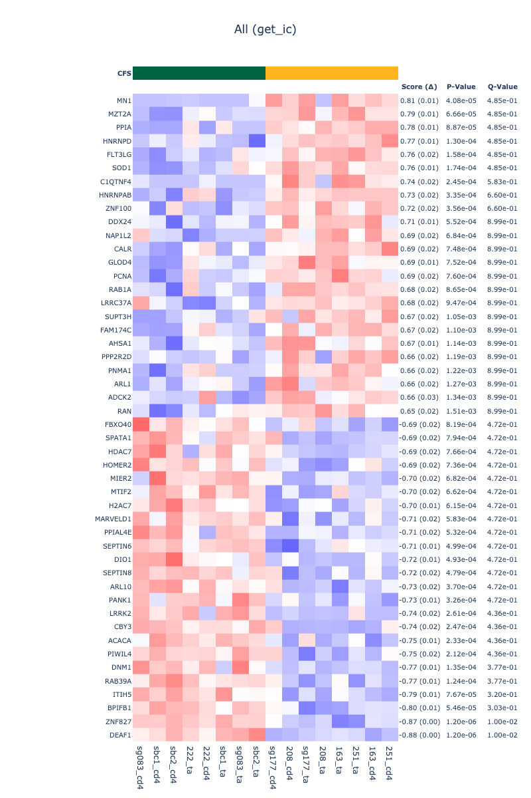

# compare_cd4_cell_in_cfs.pro

In this project, I compared the gene expressions and gene set enrichments between the healthy and the CFS samples. In this writing, I will refer to these sample groups as `Healthy` and `CFS` respectively.

There are multiple parts to this project. They are listed below:

1. [Create the gene-by-sample matrix](#create-the-gene-by-sample-matrix)
2. [Compare gene expression]()
3. [Compare the differences of differences in gene expression]()
4. [Create the gene-set-by-sample matrix using single-sample GSEA]()
5. [Compare gene-set enrichment]()

### Data

The data is from 8 people. 6 of them are `CFS` and 2 are `Healthy`. For each person, Dr Jing isolated the `TA` and the `CD4` cells. She then sequenced their total RNA.

Initially, Dr Jing game me only the first 8 samples, which I analyzed in the previous project. She then gave me another 8 samples. So, this project analyzes the initial 8 samples together with the new 8 samples, with total of 16 samples.

### Create the gene-by-sample matrix

For each sample, I mapped the reads (from the `FASTQ` files) into `TPM` using `Kallisto`. I then assgined the the expression score for each gene by summing all `TPM`s of transcripts for the gene.

I also normalized the expression scores by simply adding one to all and then logging with base two.

### Compare gene expression

I compared the gene expressions between the following groups:
1. `Healthy` vs `CFS`
2. `CFS TA` vs `CFS CD4`

I compared the expressions by two functions:
1. By simply taking the differences
2. By computing information coefficient, a better way of computing association

#### `Healthy` vs `CFS` 

#### `CFS TA` vs `CFS CD4` 

### Compare the differences of differences in gene expression

### Create the gene-set-by-sample matrix using single-sample GSEA

### Compare gene-set enrichment

## Howdy :wave: :cowboy_hat_face:

To report a bug, request a feature, or leave a comment (about anything related to this repository), just [submit an issue](https://github.com/GIT_USER_NAME/compare_cd4_cell_in_cfs.pro/issues/new/choose).

---

**Lean Project** made by https://github.com/KwatMDPhD/LeanProject.jl
