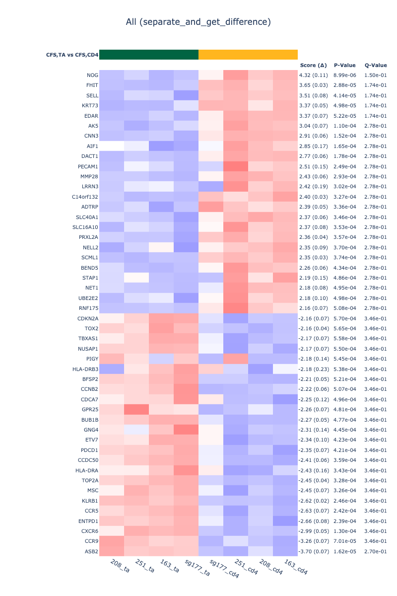
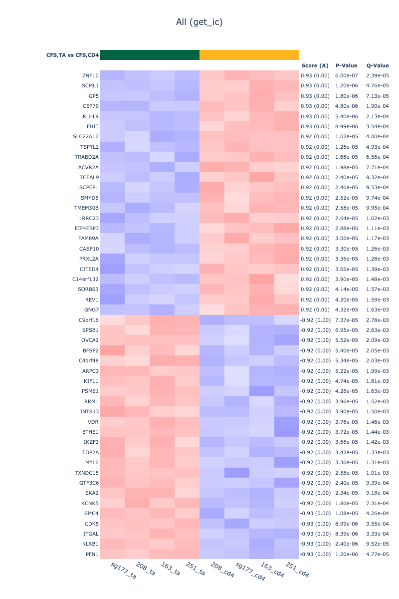
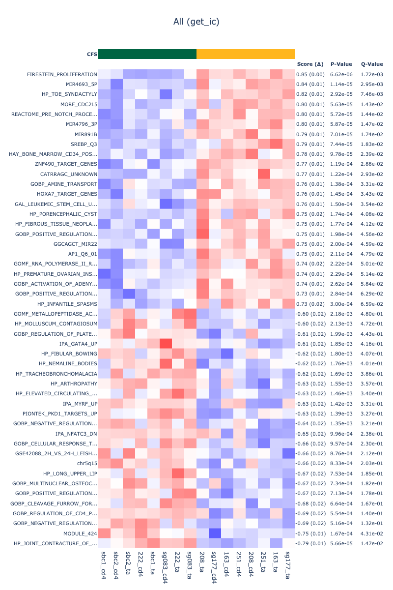
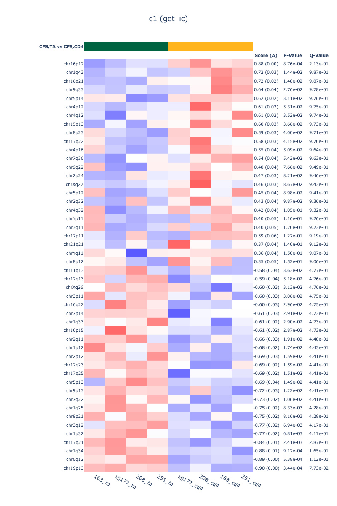

# compare_cd4_cell_in_cfs.pro

In this project, I compared the gene expressions and gene set enrichments between the healthy and the CFS samples. In this writing, I will refer to these sample groups as `Healthy` and `CFS`, respectively.

There are multiple parts to this project. Each part has a corresponding folder in [`output`](./output), containing all figures and `.tsv`s.

1. [Prepare the data](#1.-prepare-the-data)
2. [Create the gene-by-sample matrix](#2.-create-the-gene-by-sample-matrix)
3. [Compare the gene expressions](#3.-compare-the-gene-expressions)
4. [Compare the differences of the differences in the gene expressions](#4.-compare-the-differences-of-the-differences-in-the-gene-expressions)
5. [Create the gene-set-by-sample matrix using single-sample GSEA](#5.-create-the-gene-set-by-sample-matrix-using-single-sample-gsea)
6. [Compare the gene-set enrichments](#6.-compare-the-gene-set-enrichments)

### 1. Prepare the data

The data is from eight people. Four people are `Healthy` and the other four are `CFS`. For each person, Dr Jing isolated the `TA` and the `CD4` cells. She then sequenced their total RNA.

Initially, Dr Jing game me only 8 samples (1 `Healthy` and 3 `CFS`), which I analyzed in the previous project. She then gave me another 8 samples (3 `Healthy` and 1 `CFS`). And this project analyzes all of them together, with total of 16 samples (4 `Healthy` and 4 `CFS`).

### 2. Create the gene-by-sample matrix

For each sample, I mapped the reads (from the `FASTQ` files) into `TPM` using `Kallisto`. I then assgined the the expression score for each gene by summing all `TPM`s of transcripts for the gene.

I also normalized the expression scores by simply adding one to all and then logging with base two.

### 3. Compare the gene expressions

I compared the gene expressions between the following groups:

1. `Healthy` vs `CFS`
2. `CFS TA` vs `CFS CD4`

I compared the expressions by two functions:

1. `separate_and_get_difference`, which simply takes the difference between the median expressions of the groups. So, its `Score` means _the difference in the gene expression between the groups_.
2. `get_ic`, which computes information coefficient between the group membership and the expression. So its `Score` means _the association between the group and the gene expression_.

#### `Healthy` vs `CFS`

#### `CFS TA` vs `CFS CD4`

### 4. Compare the differences of the differences in the gene expressions

I plotted on the `X-axis` the gene-expression difference between `TA` and `CD4` in `Healthy`: `Healthy CD4` - `Healthy TA`.

I then plotted on the `Y-axis` the gene-expression difference between `TA` and `CD4` in `CFS`: `CFS CD4` - `CFS TA`

So the genes in the left-lower area and the right-upper area are the genes whose expressions change drastically and consistently in both `Healthy` and `CFS`.

The genes in the left-upper area, however, have **decreased** expressions in `Healthy` but **increased** expressions in `CFS`.

Conversely, the genes in the right-lower area have **increased** expressions in `Healthy` but **decreased** expressions in `CFS`.

### 5. Create the gene-set-by-sample matrix using single-sample GSEA

Using `single-sample GSEA`, I computed the enrichments of over 30,000 gene sets, containing [the Molecular Signature Database collections](http://www.gsea-msigdb.org/gsea/msigdb/collections.jsp), [the Ingenuity Pathway Analysis collection](https://digitalinsights.qiagen.com/products-overview/discovery-insights-portfolio/analysis-and-visualization/qiagen-ipa/?cmpid=QDI_GA_IPA&gclid=Cj0KCQjwrJOMBhCZARIsAGEd4VG5KP7qCQniga38ftVeIWhiXE5lSxQNUVxiDVcnsOFhz9-mGuB855saAhwHEALw_wcB), and [my original collections](https://github.com/KwatMDPhD/gene_set.pro).

### 6. Compare the gene-set enrichments

Just as I compared the gene expressions, I compared the enrichments between the groups. However, since a difference in the enrichment score is difficult to interpret, it did not make sense to use `separate_and_get_difference`. So, I only computed the association between the groups and the enrichments using `get_ic`.

For better interpretation, I also plotted the same `function_heat_map` for each gene-set collection.

#### `Healthy` vs `CFS`

##### All gene-set collections

##### Gene-set collection H: hallmark gene sets

##### Gene-set collection C1: positional gene sets

##### Gene-set collection C2: curated gene sets

##### Gene-set collection C3: regulatoray target gene sets

##### [Gene-set collection C4: computational gene sets](./output/compare_set/cfs/get_ic/c4.png)

##### Gene-set collection C5: ontology gene sets

##### Gene-set collection C6: oncogenic gene sets

##### Gene-set collection C7: immunologic gene sets

##### Gene-set collection C8: cell-type gene sets

##### Gene-set collection Ingenuity: Ingenuity Pathway Analysis gene sets

#### `CFS TA` vs `CFS CD4`

##### All gene-set collections

##### Gene-set collection H: hallmark gene sets

##### Gene-set collection C1: positional gene sets

##### Gene-set collection C2: curated gene sets

##### Gene-set collection C3: regulatoray target gene sets

##### [Gene-set collection C4: computational gene sets](./output/compare_set/cfs_ta_vs_cfs_cd4/get_ic/c4.png)

##### Gene-set collection C5: ontology gene sets

##### Gene-set collection C6: oncogenic gene sets

##### Gene-set collection C7: immunologic gene sets

##### Gene-set collection C8: cell-type gene sets

##### Gene-set collection Ingenuity: Ingenuity Pathway Analysis gene sets

## Howdy :wave: :cowboy_hat_face:

To report a bug, request a feature, or leave a comment (about anything related to this repository), just [submit an issue](https://github.com/GIT_USER_NAME/compare_cd4_cell_in_cfs.pro/issues/new/choose).

---

**Lean Project** made by https://github.com/KwatMDPhD/LeanProject.jl
